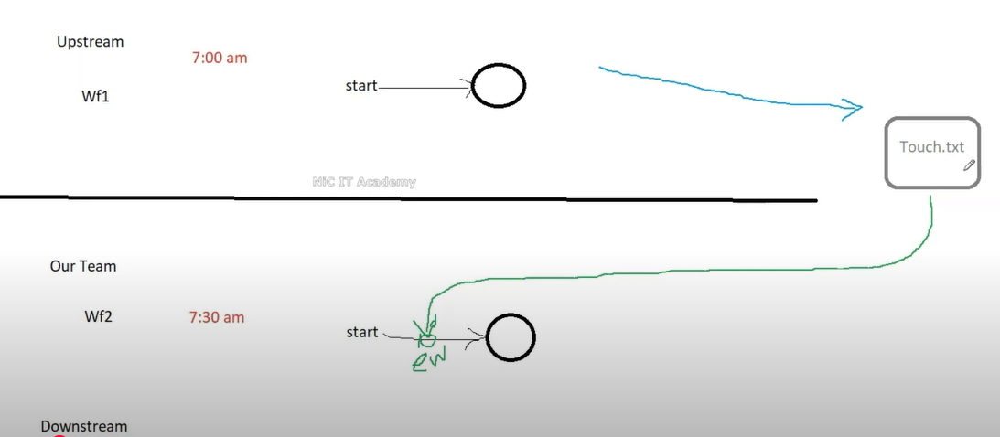
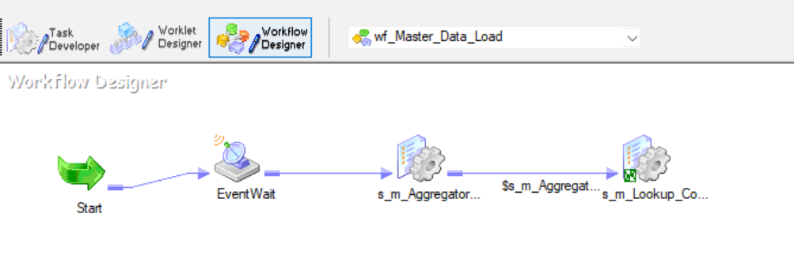
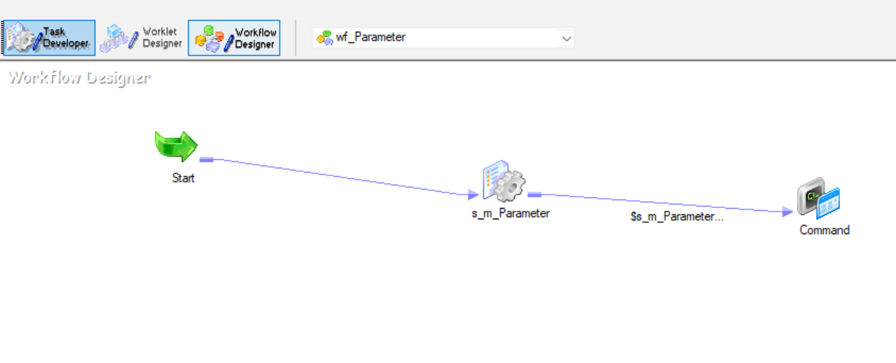
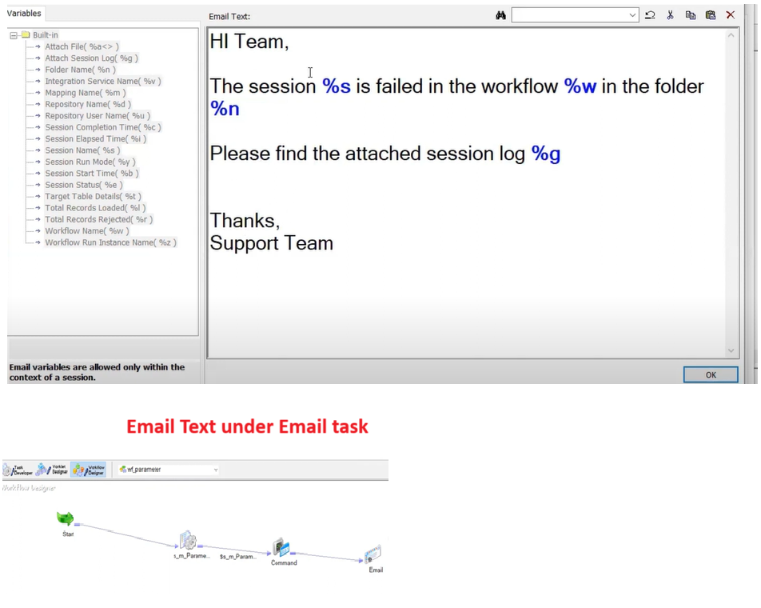
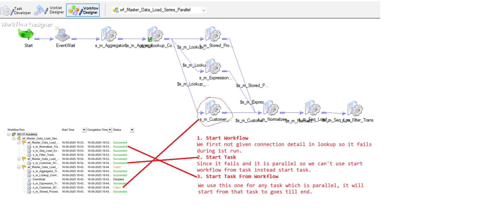
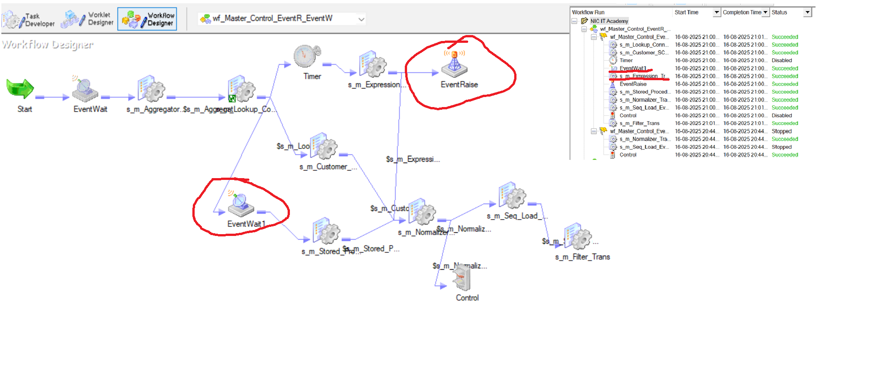
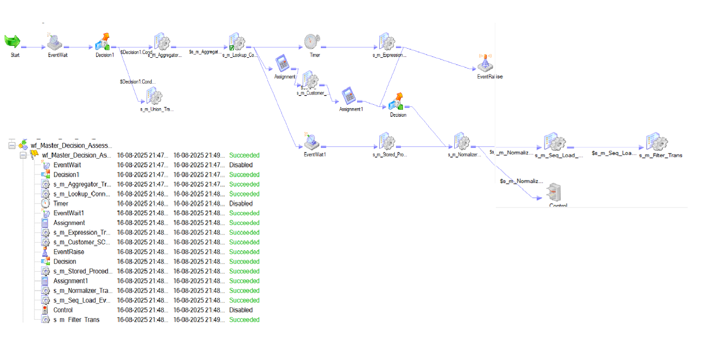

<<<<<<< HEAD
### Informatica Scenario Based Questions

1. ## SCD [Slowly Change Dimensions] Implementation
- There are three types of SCD for updating and inserting the data. Type1, Type2 and Type3
- Type 1:- No history will be maintained simple update, Type 2:- History will be maintained at Row Level history, Type 3:- Recent history will be maintained column level history
- Type 2 Methods:- Method 1:- Flag Method, Method 2:- Version, Method 3:- Date
- Type 2 Method 3 is completed in m_Customer_SCD_TYPE2_Date

2. ## Performance Tuning, Pushdown Optimization and Partitioning in Informatica
- Aggregator, Sorter, Rank, Lookup and Joiner generally we need to tune these due to its cache memory size.
- We can check with the help of long running, timeout, session failed and CPU consumption whether we need to optimize or not.
- There is Metadata Repository from where can check all the folders, workflows
- Tables OPB_SUBJECT- Folders of Informatica, OPD_WFLOW_RUN- Workflows details
- In session log we have Idle time and busy %. Idle time- If 0 means means CPU full busy(100% bottleneck). If it is near 100 then busy(0%).
- If bottleneck is in Source or Target Side we follow the below approach.
- Source- Optimize SQ Query, Optimize Lookup, Index, Collect stats, Partitioning
- Target- drop index and create index, partitioning.
- **Place the sorter before lookup, aggregator, rank and joiner to improve the performance.**
- Two methods to optimize [License Property]- 1. Pushdown Optimization[PDO] 2. Partitioning
- 1. Pushdown Optimization- Source PDO, Target PDO, Full PDO:- It will convert the transformation logic into sql query and send back to source side or target side depends upon source PDO or Target PDO.
- 2. Partitioning [Parallel Processing]
- **If one Reader thread running the job in 30 min then we can convert in three Reader thread so that each one will take 10 mins and process in parallel.**
- Max we take 10 reader thread in parallel for more than 10 we need to take admin approval.
- We need to consider three things while partitioning.
- 1. Number of Partition(thread) 2. Partition Type 3. Partition Point
# Partition Type
- 1. DB Level Partition (at db level-not in informatica)
- 2. Range Partitioning[some range of data like 10-20 Product_id]
- 3. Passthrough partition[Default partition even for one partition]
- 4. Round Robin [Based on thread availability]
- 5. Hash Auto Key [We can use with any of these Aggregator, Sorter, Rank, Lookup and Joiner ]
- 6. Hash User Key [We can use with any of these Aggregator, Sorter, Rank, Lookup and Joiner ]
- You can't delete if you have single partition.
- Throughput will increase means process data in less time. For less no. of records it won't show much difference.
- 
- 
- 
- 
# Partition Point

3. ## Workflow Task in Informatica
- 1. Session(Non reusable, reusable task) 2. Email (Non reusable, reusable task) 3. Command (Non reusable, reusable task) 4. Event Wait 5. Event Raise 6. Timer 7. Assignment 8. Control 9. Decision 10. Worklet 11. Link Task 12. Scheduler
- If you create any task under task developer it will be reusable task.
- In reusable task we can't modify inside mapping under workflow like pre sql, post sql and many more. But we can modify in task developer because since it is reusable if we modify at one place it will modify in the all workflows.
- **If two sessions are connected in series and dependent then we need to *double click on link task* and put "$s_m_Aggregator.Status=succeeded". If we don't make any condition on link task if it fails the next task will auto trigger and succeed.**
- If we want to create the workflow to be dependent then we need create one file and present it to *Event Wait*
- 
- We can create file here in window machine but in real time project it is in linux. So in the 1st workflow we can add command task at the end of session where we can write command like *echo >C:\Informatica\touch.txt*(in windows) *touch touch.txt*(in linux) to create file.
- And in the starting of 2nd of workflow we create the event wait and mention the location of file created and select the option *Delete Filewatch File* so that one next day 2nd workflow don't start automatically after watching this file at the location new file has to be there.
- We are using **wf_Parameter** and **wf_Master_Data_Load workflows** to make it dependent.
- 
- 
- Here email will not trigger because for that SMTP server required.
- 
- Let suppose we have many sessions in the workflow so for each session we can't add separate email for failure. For that one we will create the reusable email task and goto the component section of each session and On Failure E-Mail select type reusable and select the reusable email_session.
- There are three options to start workflow 1. Start workflow- It will start workflow from beginning. *2. Start workflow from task- It will start the workflow from that particular task and complete till last if it is in series.* **3. Start Task- It will only start that particular task, generally we use this one when multiple sessions are in parallel and any one got failed then one by one we will start all task.**
- We can see all these in wf_Master_Data_Load_Series_Parallel
- 
- We can add the **timer** late start any session. We can add **control** task to fail me and fail parent and some more option without impacting or actual failing of session and stop parent(it will stop the immediately), abort parent(wait for 20 sec to finish), These will impact the workflow.
- This workflow contain almost all non reusable task **wf_Master_Control_EventR_Decision_Assignment**
- **Event Raise**- We need to workflows edit option then events and declare the event 1st before adding event raise task.
- **Event wait**- There are two options. 1. Predefined- It is file-watch event. 2. User-Defined- It is an event created on workflow properties event tab. And enable past event.
- 
-  

4. ## Pre Post session variable assignment in Infomatica
- YT chanel:- USA Skill Development Centre
- Pre session command, Post session success command, Post session failure command, On success email, On failure email, Pre session variable assignment, Post session on success variable assignment, Post session on failure variable assignment.
- In Pre session variable assignment:- It is happening from workflow to mapping.
- In Post session on success variable assignment:- It is happening mapping to workflow.
- We can create the resusable or non reusable command or email task.

5. ## Informatica Mapping variable and parameter
- $$- Mapping level parameter, $- Session level parameter.
- We have seen *$PMSourceFileDir*- on mapping level.
- Let suppose we are changing the environment or path over period of time than in that case the parameter will be useful.
- Parameter- It will not change the value during run time. like $$salary=1000
- Variable- It may change the value during run time. Like $$count=$$count+1
- GLobal Parameter- Any workflow or mapping can read the parameter, Local Parameter- It is local to the particular session.
- We declare globlal parameter like *[GLOBAL]* We declare local parameter like *[folder name.WF:workflow name.ST:session name]* i.e *[Training_5.WF:wf_Parameter.ST:s_m_Parameter]*
- We can save the parameter file in this dir- *C:\Informatica\10.4.1\server\infa_shared\BWParam* 
- under param.txt *[GLOBAL] 
$$WHERE=salary>15000*
- **We created m_Parameter mapping to simply load employees data, Then got SQ trans properties and in SQL query generate SQL and give $$WHERE at the end as parameter.**
- **Then goto mappings on top and click parameter and variable and new parameter and variable  Name- $$WHERE Type- Parameter, Datatype- string, Prec- 1000**, in ExprVar- False
- **Then In session properties Parameter Filename we place C:\Informatica\10.4.1\server\infa_shared\BWParam\param.txt**

