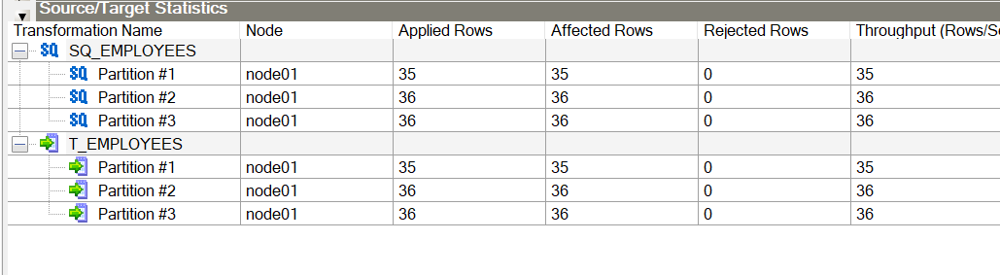
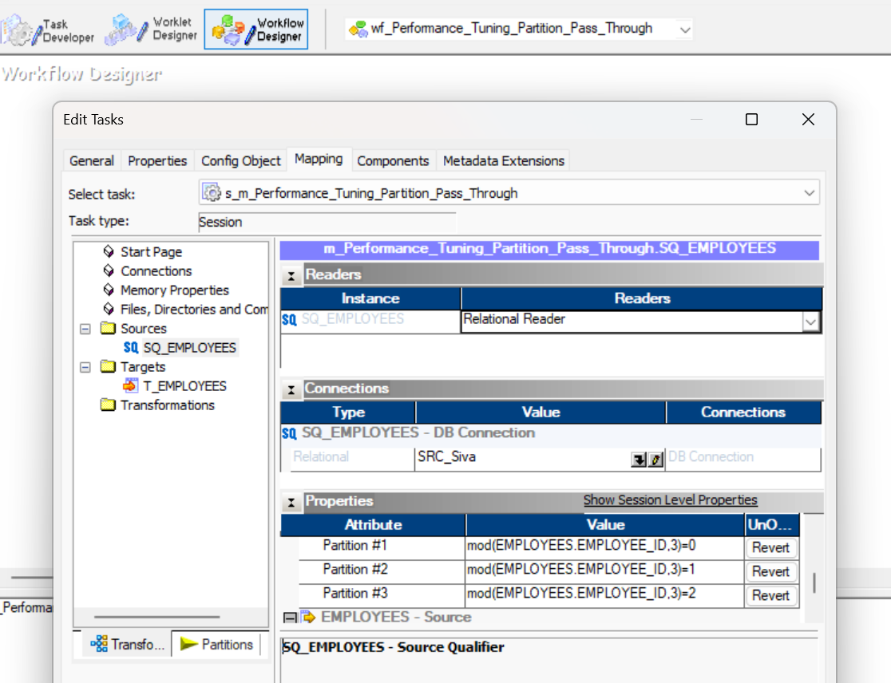
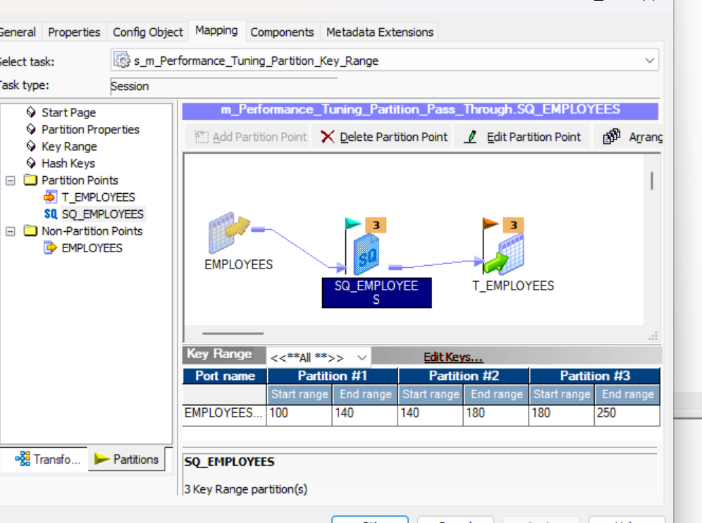
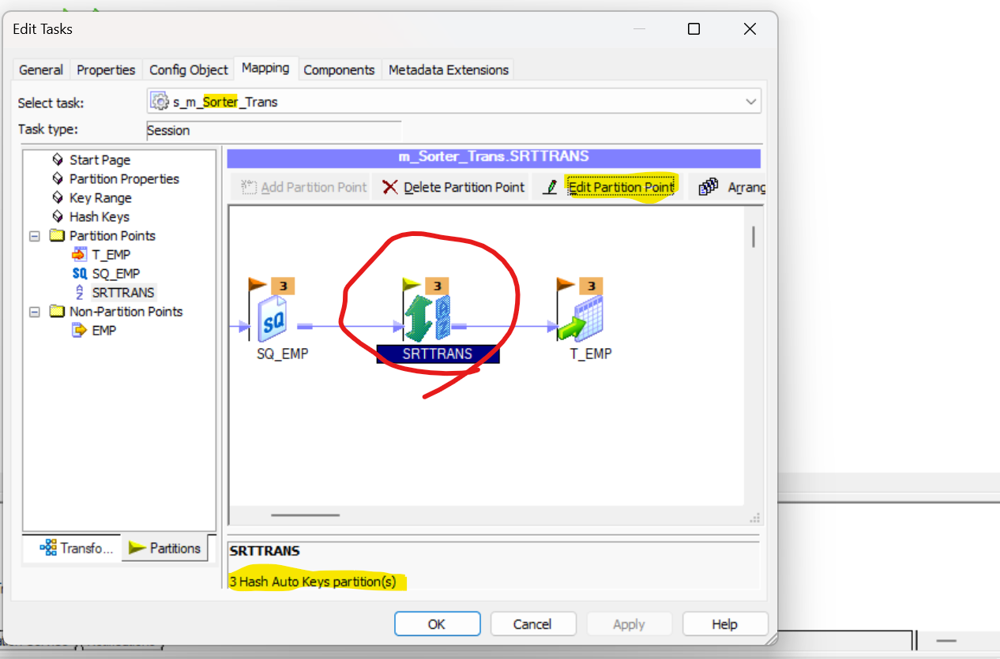

### Informatica Scenario Based Questions

1. ## SCD [Slowly Change Dimensions] Implementation
- There are three types of SCD for updating and inserting the data. Type1, Type2 and Type3
- Type 1:- No history will be maintained simple update, Type 2:- History will be maintained at Row Level history, Type 3:- Recent history will be maintained column level history
- Type 2 Methods:- Method 1:- Flag Method, Method 2:- Version, Method 3:- Date
- Type 2 Method 3 is completed in m_Customer_SCD_TYPE2_Date

2. ## Performance Tuning, Pushdown Optimization and Partitioning in Informatica
- Aggregator, Sorter, Rank, Lookup and Joiner generally we need to tune these due to its cache memory size.
- We can check with the help of long running, timeout, session failed and CPU consumption whether we need to optimize or not.
- There is Metadata Repository from where can check all the folders, workflows
- Tables OPB_SUBJECT- Folders of Informatica, OPD_WFLOW_RUN- Workflows details
- In session log we have Idle time and busy %. Idle time- If 0 means means CPU full busy(100% bottleneck). If it is near 100 then busy(0%).
- If bottleneck is in Source or Target Side we follow the below approach.
- Source- Optimize SQ Query, Optimize Lookup, Index, Collect stats, Partitioning
- Target- drop index and create index, partitioning.
- **Place the sorter before lookup, aggregator, rank and joiner to improve the performance.**
- Two methods to optimize [License Property]- 1. Pushdown Optimization[PDO] 2. Partitioning
- 1. Pushdown Optimization- Source PDO, Target PDO, Full PDO:- It will convert the transformation logic into sql query and send back to source side or target side depends upon source PDO or Target PDO.
- 2. Partitioning [Parallel Processing]
- **If one Reader thread running the job in 30 min then we can convert in three Reader thread so that each one will take 10 mins and process in parallel.**
- Max we take 10 reader thread in parallel for more than 10 we need to take admin approval.
- We need to consider three things while partitioning.
- 1. Number of Partition(thread) 2. Partition Type 3. Partition Point
# Partition Type
- 1. DB Level Partition (at db level-not in informatica)
- 2. Range Partitioning[some range of data like 10-20 Product_id]
- 3. Passthrough partition[Default partition even for one partition]
- 4. Round Robin [Based on thread availability]
- 5. Hash Auto Key [We can use with any of these Aggregator, Sorter, Rank, Lookup and Joiner ]
- 6. Hash User Key [We can use with any of these Aggregator, Sorter, Rank, Lookup and Joiner ]
- You can't delete if you have single partition.
- Throughput will increase means process data in less time. For less no. of records it won't show much difference.
- 
- 
- 
- 
# Partition Point

3. ## Workflow Task in Informatica
- 1. Session(Non reusable, reusable task) 2. Email (Non reusable, reusable task) 3. Command (Non reusable, reusable task) 4. Event Wait 5. Event Raise 6. Timer 7. Assignment 8. Control 9. Decision 10. Worklet 11. Link Task 12. Scheduler

4. ## Pre Post session variable assignment in Infomatica
- YT chanel:- USA Skill Development Centre
- Pre session command, Post session success command, Post session failure command, On success email, On failure email, Pre session variable assignment, Post session on success variable assignment, Post session on failure variable assignment.
- In Pre session variable assignment:- It is happening from workflow to mapping.
- In Post session on success variable assignment:- It is happening mapping to workflow.
- We can create the resusable or non reusable command or email task.

