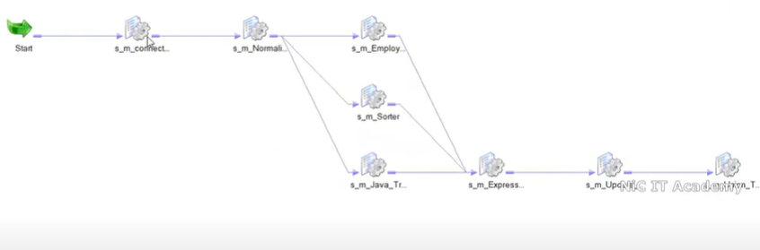

<<<<<<< HEAD
# Informatica 10.4.1 NIC_IT_Academy
## Installation
- 📺 [Installation Tutorial](https://www.youtube.com/watch?v=AgODXRSht1w&ab_channel=AdamTech)
- 📥 [Download Link](https://edelivery.oracle.com/osdc/faces/Home.jspx)

## Administrator Console
- 🌐 Access URLs: 
1. Link to Informatica Administrator console:-https://inspiron:6008 or https://inspiron:6005 or https://inspiron:8443/administrator/
2. Configure these two option in integration service in Services and Node--> int
   - Resilience Timeout and Limit on Resilience Timeouts:- update to 3600 -->So that won't disconnect easily
3. -Run session Impacted by dependency:- Yes (It will allow to run failed session after modification)
4. -**If any domain error coming then goto right click inside repo and configure domain and select localhost as host and port as 6005**

================================== Informatica Tutorial ======================
## 🛠️ Core Components
### Informatica Designer
- In Repository Create Folder NIC IT Academy
- Click on D it will open Designer with all required Folder like source, target, mappings and mapplet
- Then connect and open
- It has 5 components like Source Analyser, Target Designer, Transformation Developer, Mapplet Designer and **Mapping     Designer**
- Source Analyser:- Relational DB, Flat File(txt/csv), Cobol, Xml Files
- Target Designer:- Relational DB, Flat File(txt/csv), Xml Files
- Tranformations:- Active Transformation:- Source Qualifier, Filter, Router, Aggregator, Joiner, Normalizer, Rank, Union, Sorter
- Passive Transformation:- Expression, Lookup, Sequence Generator, Stored Procedure(Stored Procedure of Database), External Procedure(Executes external programs or scripts),
Macro Transformation:- Allows for dynamic SQL generation based on mapping parameters.
DX_Notification Transformation:- Used for triggering events and notifications based on data changes.
- Transformation Developer:- Single, Reusable and can be use in multiple mapping
- Mapplet Designer:- Reusable Transformation, Set of transformation combine to create logic, can be reuse in multiple Mapping
- Mapping Designer:- Basic Logic

### Informatica Workflow Designer
- Click on W it will open Workflow Designer
- It has three components:- Task Developer(Single reusable session), Worklet Designer(Combination of multiple sessions, this can be reuse), Workflow Designer(Designing one time workflow)
- In workflow--> Goto workflows-->create worflow--> Drag and drop session and link icon
- Goto connections--> Relational-->(In prod admin team will create and for security reason we can use parameterised connection)
- Open session and goto-->config object-->stop on errors-->select 1(If 1 error occurs stop the workflow)
- Open session and goto--> general-->select-->Fail parent if task fails
- Open session and goto--> Mapping--> check source target connection
- Validate the mapping and save
- Now click on blank screen and start workflow

### Informatica Monitor
- Run status(Running/Succeeded/Failed/Aborted/Stopped), Row count(source/target), Throughput(records/sec), Session log
- Reader, Writer thread

1. ## Table to Table Load 
- In Designer Click on source Analyser-->Sources(Title bar)-->Select ODBC Data Source (Oracle (DataDirect 8.1 Oracle Wire Protocol))--Similarly for Targets
- Goto-->Mappings-->Create Mapping-->Drag and drop source and target
- Source Qualifier:- It is converting source data type to informatica native data type and it is use for filter our unique records from database by enabling distinct and it can't filter out from flat file. Cobol file not allowed here.
- In workflow--> Goto workflows-->create worflow--> Drag and drop session and link icon
- Goto connections--> Relational-->(In prod admin team will create and for security reason we can use parameterised connection)
- Validate the mapping and save
- Now click on blank screen and start workflow

2. ## Flat File to Table Load
- We need to export csv emp data to this location C:\Informatica\10.4.1\server\infa_shared\SrcFiles
- In src-analyser only do clear all don't delete the source otherwise dependent mapping will be invalid
- Sources-->Import from flat file-->Delimited [comma, or ;],  Fixed width [having fixed width space separation]
- And check import field names from first line--> in next indicate the delimiters used in the flat file tab, senicolon, comma, space and other and double quote as text " " and phone number in text if 123.456.7891
- And datetime also need to select -->click on source-->properties-->datetime format dd/mm/yy(whatever in source)
- In workflow-->session-->mapping-->sources-->src file directory:-$PMSourceFileDir\ which is (C:\Informatica\10.4.1\server\infa_shared\SrcFiles)
- Then check the file name as s_FF_Emp.csv
- Save and validate then start workflow

3. ## Table to Flat File Load
- Source:- Import from database
- Target:- 1st way:- If you have already database table file then copy and paste and rename to t_FF_Tab_Name for same structure as table for target flat file. And select db_type as Flat file
- Target:- 2nd Way:- Create :- Enter new name select db_type as Flat File
**Note**:- But in this column name and data type need to mention manually
- In target properties header option by default no header but we can other option as well

4. ## Generate target file with timestamp
- Taking above as reference Goto *Target Designer*
- On top add Filename column to this table which is right most don't add new column directly
- At last row one non-editable 255 precesion column with Filename will be created
**Goto Mapping**
- Just before target add *expression transformation* and add a column at the end with filename which is dynamic filename 100 precesion and select *output port(O)*
- In *expression tab* double click and add 't_FF_Emp'||to_char(systimestamp(), 'DDMMYYYYHH24MISS')||'.csv') and validate
- And link the last column of *expression transformation* to target file last column which is filename and save mapping(validate and save) and in workflow on session just refresh session and validate and save.
- start workflow

5. ## Filter Transformation [Active and Connected]
- In filter transformation it actually apply filter condition anywhere in the pipeline and source qualifier only apply filter at source only
- In *Source Qualifier we only filter the data from * **table** and in flat file the SQ properties filter and some other options are disabled
- There is True:- which pass all the rows and False:- Do not pass any record
- We can add manual condition to filter out row by using isNUll, not , =,>=,<=,<,> and many more
- In mapping sources we need to click Set File properties and set the delimiter over there

**Note:- In workflow under mapping section always check these option according to requirments
-Truncate target table option, In config object:- stop on errors 1, in general:- fail if parent if this task fails

6. ## Expression Transformation [Passive and Connected]
- Whatever no. of i/p we provide same no. of o/p we received that's why passive trans
- It has basically 3 ports i/p, o/p and variable port and another is expression(not a port). For any expression both i/p and o/p are not enable at same time if we have any expression then we need to create new column and enable o/p port and expression will be enabled.
- Variable port for intermediate calculation you can't take variable port output. v_c=a+b o_c=v_c
- o/p port- We can't take it to the next level (again and again use not permitted) and Variable Port- We can take it to the next level
- Order of execution i/p>v>o/p, We can't apply any filter condition because of passive trans
- IFF(condition,true,false) - IFF(sal>1300, email||'@gmail.com',email||'@yahoo.com')
- '+1-'||REPLACEHR(0,PHONE_NUMBER,'.','') - case insensitive replace 0- a A replace with X(case insensitive)  1- A replace with X(case sensitive)
- IFF(ISNULL(COMM),0,COMM)
- Sequence generate by using variable port v_seq-->v_seq+1    o_seq-->v_seq

7. ## Joiner Transformation [Active and Connected]
- For all different sources we have one source qualifier(SQ) **but if we add joiner then we need to create as many SQ as sources.**
- SQ Joiner:- Homogeneous source (same source) and SQ Joiner is used to join the data from same source(database)
- Joiner Transformation:- Heterogeneous source (different source) and Joiner Transformation is used to join the data from different sources
- Joiner Transformation is used to join the data from different sources like flat file and database or two different database
- Types of Joiner Transformation:- Normal Join(inner), Master Outer Join(left outer join) all from D and matching from M, Detail Outer Join(right outer join all from M and Matching from D), Full Outer Join
- If there are n sources then we need to create **n-1** Joiner Transformation.
- Less no. of records in master source to create cache.
- Goto properties and select join condition like D.dept_id=M.dept_id and goto port and select the join type as normal join

8. ## Sorter Transformation [Active/Passive and Connected]
- Sorter is working as **active** when we select distict option because it will reduce the no. of records
- Sorter is working as **passive** when we don't select distinct option because it will not reduce the
- null is treated as highest value in sorter transformation
- Sorter transformation is used to sort the data in ascending or descending order based on one or more columns.
- Sorter will have 4 ports:-i/p, o/p, key and direction port
- Key port is used to specify the column(s) on which the data should be sorted and direction port is used to specify the sort order (asc or desc).
- Sorter cache size:- auto, **case sensitive**(B,b due to low ascii value of B it will appear 1st in ASC), Working directory $PMTempDir:- It will store all data in cache then sort
- distinct[ ] :- SQ will not allow distinct option in flat file but Sorter will allow distinct option in flat file
- Null is teated as low [] by default null is treated as high [] in sorter transformation
- We sort the data to improve the performance of other transformations like joiner, aggregator, rank, etc.

9. ## Aggregator Transformation [Active and Connected]
- It is used to perform aggregate functions like sum, avg, count, min, max, etc. on the data.
- It is used to group the data based on one or more columns and perform aggregate functions on the grouped data.
- It has 4 ports:- i/p, o/p, group by and aggregate function port
- Group by port is used to specify the column(s) on which the data should be grouped and aggregate function port is used to specify the aggregate function to be performed on the grouped data.
- **Irrespective of no. of records you will get last record as o/p it you don't select group by port**
- To find out the sum of salary of employees if we use directly sum(sal) then it will give us the last record as o/p, to overcome this we need to select *group by* port on deptno or which ever column we want to group the data.
- **In Oracle SQL we have having clause so to implement same in informatica we have filter transformation after aggregator**
- *sorted input enable []* If we select this option then it assume whatever port we selected in group by port is already sorted and it will improve the performance of aggregator transformation. If we don't give sorted input data then informatica job will fail.
- *If we don't select group by port and selected sorted input then the job will not fail*
- To add sorted input data we need to add sorter transformation before aggregator transformation and select the same port in group by port.
- **For row level sum we should never go for aggregate instead we use + sign and for column level we can use aggregate function**
- We have 5 ports in aggregator transformation:- i/p, o/p,variable, expression and group by
- The main diff bw aggregator and expression is that in aggregator we have one extra folder aggregate function.

10. ## Router Transformation [Active and Connected]
- It is just like filter transformation but it is used to route the data to different output groups based on the specified conditions. Multiple filter conditions can be applied in a single router transformation.
- It has 3 ports:- i/p, o/p and group port
- Group port is used to specify the filter conditions for each output group. If not matched then it will go to default group.
- In workflow manager to select all target table same connection then right click on apply connection value -->set to all instances

11. ## Rank Transformation [Active and Connected]
- It has 4 ports:- i/p, o/p, rank(R) and group by port
- Properties:- Rank type:- Top N, Bottom N, Percent, Rank by port:- select the port on which we want to rank the data
- **We can't do dense rank directly instead we can add expression transformation to make dense rank**
- Case sensitive String comparison:- If we select this option then it will treat A and a as different values and it will give us different rank for A and a.
- You may be leave the *rank index* port empty if you don't want to link it with any other transformation.

12. ## Sequence Generator Transformation [Passive and Connected]
- Sequence generator has only 2 rows nextval and currval
- In properties we have:- Start value, Increment by, end value, Current value, Cache size, Cycle- enable/disable, No. of cached values- It generates next n values and store in cache, Reset
- If cycle and reset both are enabled then it will reset the sequence to current value and start generating the sequence from current value after again running the workflow.
- If cycle is enabled then it will generate the sequence from current value after reaching end value.
- If reset is enabled then it will reset the sequence to start value after reaching end value.

- # Seq Gen:- Case 1:- Load every 4th record to target table
- In sequence generator transformation set start value as 1, increment by 1, end value as 4, current value as 1 and cycle as enabled and reset is also enabled.
- Add filter transformation after sequence generator and link propogate nextval from seq gen to filter and put condition nextval=4

- # Seq Gen:- Case 2:- Load 1st record to first target table and 2nd record to second target table and 3rd record to third target table and 4th record to 1st target table and 5th record to second target table and so on.
- In seq gen we set start value as 1, increment by 1, end value as 3, current value as 1 and cycle as enabled and reset is also enabled.
- Add router transformation after sequence generator and link propogate nextval from seq gen to router and put condition nextval=1 for first target table, nextval=2 for second target table and nextval=3 for third target table.

13. ## Union Transformation [Active and Connected]
- It is exactly opposite of router transformation.
- It is used to combine the data from multiple input groups into a single output group.
- Same structure table and heterogeneous sources.
- **Union is act like a union all in Informatica and to remove duplicates we need to use sorter transformation(distinct option) after union transformation.**
- Column names might be different but data type should be same.
- **Union is act like active instead of without changing the no. of input output records because it change the rowid and row number**

14. ## Lookup Transformation [Active and Connected]
- Lookup some value for the pipeline and it is used to look up a value from a reference table or file based on a specified condition.
- It has 4 ports:- i/p, o/p, lookup and return port
- If table is there in the source side then we can go for **joiner** transformation.
- If table is there in the source, target, in mid of pipleline or instead of table we have flat file then we can go for **lookup** transformation.
- 
- 
- 

15. ## Lookup Transformation [Active and UnConnected]
- In unconnected lookup transformation, we can use multiple return ports by using concatenation operator || to return multiple values from the lookup transformation otherwise we need to use multiple lookup transformations to return multiple values.
- In unconnected lookup transformation, we can use the lookup transformation in the expression transformation or any other transformation by using the LKP function.
- 
- We can use output port in expression transformation with this formula [(:LKP.LKP_NAME(COMMON_COLUMN)]
- Under wokflow manager in mapping section for lookup transformation we need to select object (source or target relational) connection.

16. ## Update Strategy Transformation [Active and Connected]
- 
- 
- If we don't have primary key it won't update the record in target table.
- We need 8 transformations to achieve SCD Type 1 Source Definition, Source Qualifier, Lookup, Expression, Router, Update Strategy, 2 Target Definition 
- We need to link customer_id from source to lookup transformation and in lookup transformation we get the table column from target table and we link all the lookup columns to expression transformation.
- In expression transformation we can add the all columns except in_customer_id from SQ and lookup transformation and we add two more columns new_record_flag and upd_record_flag.
- In expression transformation we can add the logic to set **new_record_flag=iif(isnull(lkp_CUSTOMER_ID),true,false)** and **upd_record_flag=iif(lkp_CUSTOMER_ID=CUSTOMER_ID and lkp_CUSTOMER_NAME!=CUSTOMER_NAME or lkp_EMAIL!=EMAIL or lkp_PHONE!=PHONE or lkp_CITY!=CITY or lkp_COUNTRY!=COUNTRY,true, false)** based on the condition whether the record is new or updated.
- We rename all lookup columns in expression trans like lkp_CUSTOMER_ID as CUSTOMER_ID, lkp_CUSTOMER_NAME as CUSTOMER_NAME and so on.
- **We link all the columns includes new_record_flag and upd_record_flag from expression transformation to router transformation except lookup columns from exp trans.**
- In router transformation we can add two groups new_record and upd_record and we can set the condition for new_record as new_record_flag=true and upd_record as upd_record_flag=true.
- We link new_record_flag group to target table 1 and upd_record group to update strategy and in properties -->update strategy expression we write dd_update and linked to target table 2.

17. ## Java Transformation [Active/ Passive and Connected]
- If Active:- The transformation can generate more than one output row for each input row.
- If Passive:- The transformation can generate only one output row for each input row.
- Java transformation provides a simple native interface to define transformation functionality with java programming language. To create encryption or decryption logic we can use java transformation.
- There are two kinds of ports in java one is input port and another is output port.
- There is one java code editor we need to goto **On input row** and clear and write the java code to perform the transformation logic.
- If there is any jar file then we need to goto workflow manager under mapping section goto java transformation and select the jar file in Class Name.
```java
String str= MOBILE_NUMBERS;
String temp[];
String delimiter="~";

temp=str.split(delimiter);

for(int i=0;i<temp.length;i++)
{
o_CUST_ID=CUST_ID;
o_CUST_NAME=CUST_NAME;
o_CUST_DOB=CUST_DOB;
o_MOBILE=temp[i];

generateRow();
}
```
- 


### How to create dependency between session in Informatica
- There are two to more than two sessions can be linked together in workflow manager either by in parallel or in sequence.
- In workflow manager, right click on the session and select "Link Tasks" option and on each task we can set success or failure condition to link the tasks.
- In parallel, all the tasks will run at the same time and in sequence, one task will run after the previous task is completed successfully and we can set "And" or "Or" condition to link the tasks. If few tasks are in parallel and "And" condition is set then all the tasks should be completed successfully to run the next task and if "Or" condition is set then any one of the task should be completed successfully to run the next task.
- **In workflow manager under mapping section we select "stop on error 0" means if any record got failed the task will not fail and if we change "stop on error 1" if any single record fail it will fail the task**
- Let suppose we want run from mid of any sessions then we can select "Run workflow from task" option and select the task from where we want to run the workflow if it is in sequence and if it is in parallel then we can select "Run the task" option and run individual task.
- 

18. ## SQL Transformation [Active and Connected]

- Instead of joiner or lookup transformation we can use SQL transformation to join the data from multiple sources.
- Generally lookup will take lot of memory for cache
- SQL Transformation is used to process SQL queries in the midstream of a pipeline.
- There are two types of mode in SQL transformation *Query mode* and *Script mode* In query mode we take sql scripts directly but in script mode we take sql scripts in parameterise way.
- Under sql transformation inside query tab we paste **select dname,loc from dept where deptno=?DEPTNO?**
- We need to add the connection under *mapping sql transformation in workflow manager*
- *Generally in sql transformation we use only one table let's take emp and we fetch data through sql query in sql transformation*
- We can insert, update, delete and retrieve rows from the database at run time using the SQL
transformation.
- The following SQL statements can be used in the SQL transformation.
Data Definition Statements (CREATE, ALTER, DROP, TRUNCATE, RENAME),DATA MANIPULATION statements (INSERT, UPDATE, DELETE, MERGE), DATA Retrieval Statement (SELECT), DATA Control Language Statements (GRANT, REVOKE), Transaction Control Statements (COMMIT, ROLLBACK)
- We need to select all native sql datatypes for all the columns in SQL transformation.
- In sql port we can write the SQL query to join the data from multiple sources and in output port we can specify the columns to be returned from the SQL query.

### Different ways to perform migration/deployment of Informatica objects
**Export/Import**: Export the objects from the source environment and import them into the target environment using the Informatica Administrator console or command line utilities.
-It is valid for lower env like dev to qa or qa to uat
**Deployment Groups**: Create a deployment group in the source environment and add the objects to the deployment group.
- You should have permission to create deployment group
**Copy/Replace Folder**: Copy the folder containing the objects from the source environment and replace the folder in the target environment.
- If you have more no. of informatica objects then this is the best way to migrate the objects.

### Debugger in Informatica | How to backtrack or resolve issue in a informatica mapping
- If session got failed then we can go for session log and check the error message and then we can go to the mapping and check the data in the source and target tables.
- But if session got succeeded and we are not getting the expected data in the target table then we can use debugger to check the data at each transformation level.

19. ## Stored Procedure Transformation [Active and Connected/ Unconnected]
- Link- https://www.youtube.com/watch?v=0EquESpXKik&t=1708s&ab_channel=RajInformaticaRealtimeHandsOnJobBasedTraining
- Stored Procedure never created in informatica neither in connected nor unconnected. It is created in database and we can call it in informatica.
- In connected stored procedure transformation we can pass the input parameters to the stored procedure and get the output parameters from the stored procedure.
- In unconnected stored procedure transformation we can call the stored procedure from the expression transformation or any other transformation by using the SP function.
- In unconnected stored procedure transformation, in expression transformation we use only one output port from the stored procedure.
- We are using **Product_Src, Product_Ctg and Product_Tgt tables and SP_Product_agg (procedure)** to demonstrate the stored procedure transformation.
- In the stored procedure, we are calculating the max price, min price, avg price and sum price of the products based on the category id and returning the values to the output parameters.
- Here whatever is fact table means transaction table we will use in stored procedure transformation.
- We imported product_ctg and product_src tables in source analyser and product_tgt table in target designer. But while creating mapping we use product_ctg as source and in stored procedure it will automatically take product_src as source and product_tgt as target.
- It is looks like lookup transformation like we use **:SP.SP_PRODUCT_AGG_UNC(CATEGORY_ID, PROC_RESULT)**
- You might use stored procedures to complete the following tasks:
1. Check the status of a target database before loading data into it.
2. Determine if enough space exists in a database.
3. Perform a specialized calculation.
4. Drop and recreate indexes.

20. ### Normalizer Transformation [Active and connected]
- Whenever we want to convert rows into column or tanspose like (SQL pivot unpivot)
- Or cobol source from Mainframe system or VSAM file then instead of SQ we use normalizer.
- In normalizer there is two extra columns like GK- generated key value, GC_ID - Generated column value
- GK- It is unique and generated for all rows
- GK_ID- It generated for each column diff values
- In normalizer transformation we generally do not drag and drop all the columns from SQ to Normalizer instead we need to create by own.
- **In normalizer there are only three data types nstring,number and string**. *Suppose we have dob as source(having date datatype) then we need to change using expression transformation using to_char then after normalizer transformation again convert into date column.*
- For port we need to goto normalizer and create columns by own and there is **Occurs** tab where we need to give how many times that particular columns repeat.
- For cobol source we don't use SQ instead we are using normalizer.

-

21. ### Source Qualifier Transformation
- It is very first transformation immediately after source.
- It will not remove duplicate from flat file because the **properties tab is disabled(except tracing level)** where distinct option is there. 
- It can remove duplicate from table(full row duplicate only) and helps in joining the two or more than two homogenous(same database) source tables.
- It has many properties like. 1. SQL- Query- Sql Override- By writing sql query, we can filter/restrict the data from source itself. 2. user defined join (homogenous- tables from same type of database), 3. source filter- filter condition(like sal is not null), 4. distinct- enable/disable (full row duplicate only), 5. Pre- SQL- SQL before data fetch(e.g index creation in source), 6. Post- SQL- SQL after data fetch (index drop in source), 7. No. of Sorted Port:- 2 means(1,2) for ordering it will sort 1st column then 2nd.
- **We can change the sql query or any properties in workflow manager session level. This one is beneficial when we are working in production and if there is any issue arise then we can get approval and make changes in session level instead of mapping level because in mapping we need to create the change request.**
- In sql query tab in properties of SQ Transformation we can write all sql query but we have separate tab for filter record (salary>8000) and for join condition we have separate tab.
- The sql query tab and other can't use simultanously.